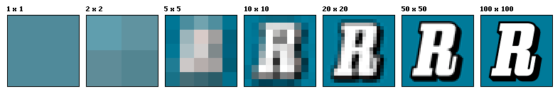
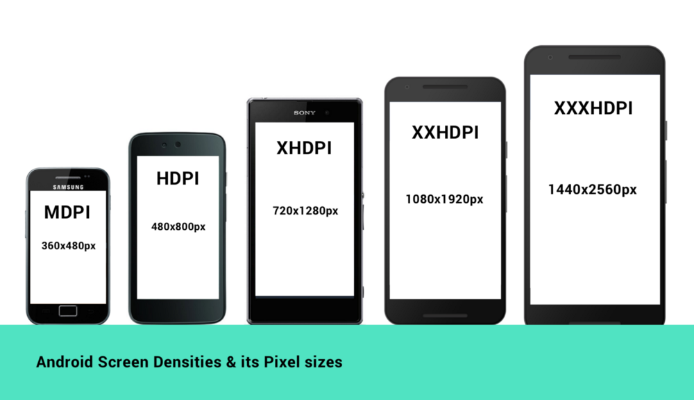
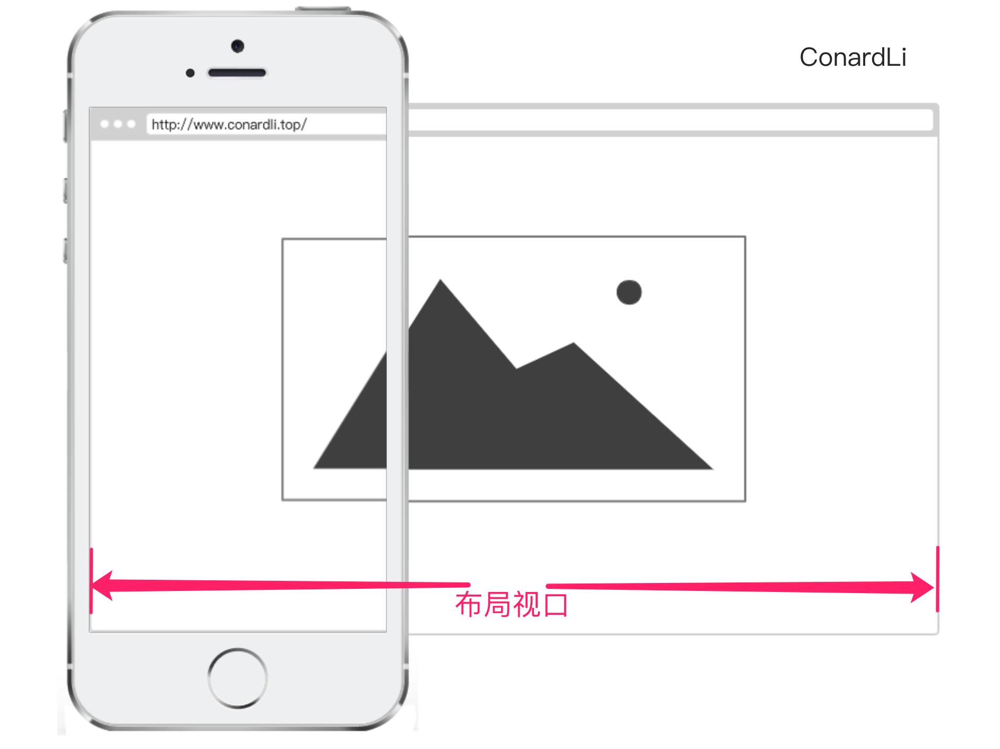
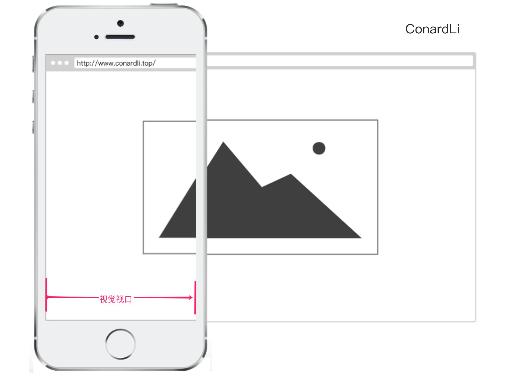
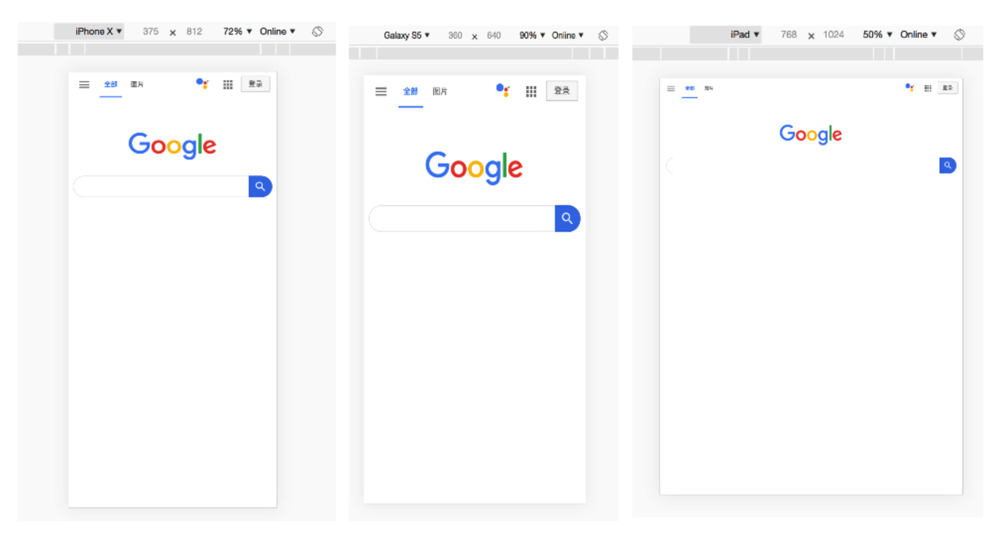
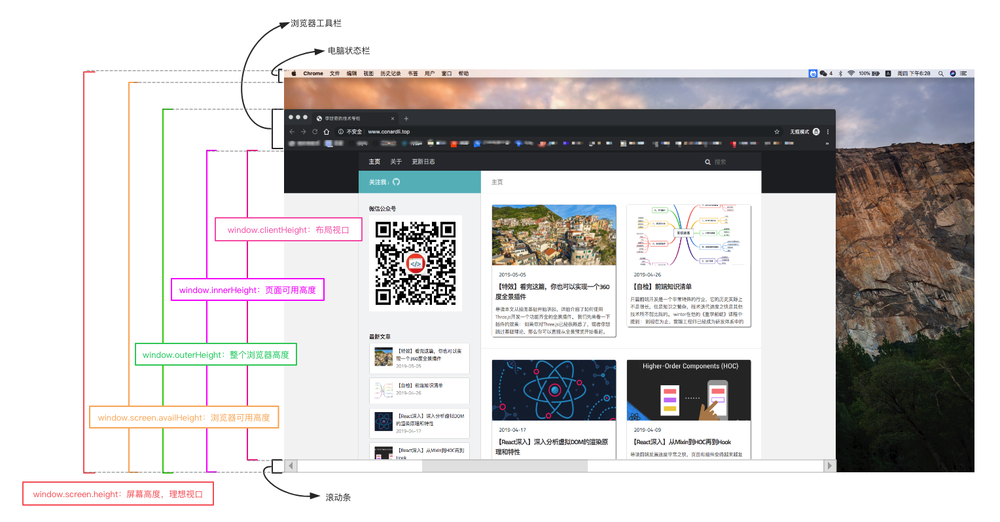

# 05-17 | 移动端适配

  阅读： [掘金 | 关于移动端适配，你必须要知道的](https://juejin.im/post/5cddf289f265da038f77696c?utm_source=gold_browser_extension)

<!-- = = = = = = = = = = = = = = = = = = = = -->

## 英寸

  - 一般用英寸描述屏幕的物理大小 → 屏幕对角线长度；
  - 英寸（ inch ，缩写 in）荷兰语中意为大拇指 → 一英寸就是指甲底部普通人拇指宽度；
  - 1 英尺 = 2.54 厘米

<!-- = = = = = = = = = = = = = = = = = = = = -->

## 分辨率

### 像素（px）

  - 一个具有特定位置和颜色的小方块；
  - 图片、电子屏幕（手机、电脑）就是由无数个具有特定颜色和特定位置的小方块拼接而成；
  - 像素可作为图片或电子屏幕的最小组成单位；
  - 通常，分辨率可分为屏幕分辨率和图像分辨率；

### 屏幕分辨率

  - 指一个屏幕具体由多少个像素点组成；
  - `iphone SE - 1136*640`：手机分别在垂直和水平上所具有的像素点数；
  - 分辨率高 != 屏幕清晰 → 屏幕清晰程度还与尺寸有关；

### 图像分辨率

  - 指图片含有的像素数；
  - `800*400`：图片分别在垂直和水平上所具有的像素点数；
  - 同一尺寸的图片，分辨率越高，图片越清晰；

  

### PPI = Pixel Per Inch

  - 每英寸包括的像素；
  - `PPI` 可以用于描述屏幕的清晰度以及一张图片的质量；
  - 使用PPI描述 **图片** 时，PPI越高，图片质量越高；
  - 使用PPI描述 **屏幕** 时，PPI越高，屏幕越清晰；
  - 因手机尺寸为手机对角线的长度，故通常使用如下公式计算PPI：

  

### DPI = Dot Per Inch

  - 每英寸包括的点数（这个 **点** 可以是屏幕像素点、图片像素点，也可以是打印机的墨点）；
  - `DPI` 最常用的是用于描述打印机，表示打印机每英寸可以打印的点数；
  - 一张图片在屏幕上显示时，它的像素点数是规则排列的，每个像素点都有特定的位置和颜色；
  - 当使用打印机进行打印时，打印机可能不会规则的将这些点打印出来，而是使用一个个打印点来呈现这张图像，这些打印点之间会有一定的空隙，这就是DPI所描述的：打印点的密度；
  - 打印机的DPI越高，打印图像的精细程度就越高，同时这也会消耗更多的墨点和时间；


> 以上描述的像素都是物理像素，即设备上真实的物理单元；

<!-- = = = = = = = = = = = = = = = = = = = = -->

## 设备独立像素（DIP、DP）

  - = Device Independent Pixels；
  - 一种用来告诉不同分辨率的手机，它们在界面上显示元素的大小是多少的单位；
  - `Retina Display`：“视网膜屏幕“概念；

### 设备像素比（dpr = device pixel ratio）

  - 物理像素和设备独立像素的比值；
  - 在 web 中，浏览器为我们提供了 `window.devicePixelRatio` 来帮助我们获取 dpr。
  - 在 css 中，可以使用媒体查询 `min-device-pixel-ratio`，区分 dpr：

  ```css
  @media (-webkit-min-device-pixel-ratio: 2),(min-device-pixel-ratio: 2){ ... }
  ```

  - 但在很多时候，是存在例外的：

  1. `iPhone 6、7、8 Plus` 的实际物理像素是 `1080 x 1920`，而在开发者工具中则发现：它的设备独立像素是 `414 x 736`，设备像素比为 `3`，设备独立像素和设备像素比的乘积并不等于 `1080 x 1920`，而是等于 `1242 x 2208`;
  2. 实际上，手机还是会将这太大的 `1242 x 2208` 塞进 `1080 x 1920` 之中的；
  3. 那么我们就将这个 `1242 x 2208` 称作屏幕的 **设计像素**，开发过程中关注的也会是这个**设计像素**；

  - 苹果使用 **视网膜屏幕** 来实现 `DPR > 1` 的屏幕，安卓也使用了相似的技术方案实现；
  - 但因安卓屏幕尺寸非常多且分辨率跨度非常大，故安卓按照设备像素密度将设备分成了几个区间：

  

### 移动端开发<Badge text="没弄懂系列" type="error" />

  - 在iOS、Android和React Native开发中样式单位其实都使用的是设备独立像素。
  - iOS的尺寸单位为pt，Android的尺寸单位为dp，React Native中没有指定明确的单位，它们其实都是设备独立像素dp

### Web端开发

  - 在写 css 时，用到最多的就是 `px`，即 css像素，当页面缩放比例为 100% 时，一个 css像素 等于 一个设备独立像素；
  - 但 css像素 很容易被改变，当用户对浏览器进行了放大，css像素 就会被放大，此时一个 css像素 会跨越更多的物理像素；
  - `页面的缩放系数 = CSS像素 / 设备独立像素`

### 关于屏幕

  - `Retina` 屏幕只是苹果提出的一个营销术语；
  - 让多个物理像素渲染一个独立像素只是 Retina 屏幕为了达到效果而使用的一种技术，而不是所有 DPR > 1 的屏幕就是 Retina 屏幕
  - 两个经常被用于形容屏幕的单位：`K` 和 `P`：
  1. `P` 代表的就是屏幕 **纵向** 的像素个数，`1080P` 即纵向有1080个像素，分辨率为 `1920X1080` 的屏幕就属于1080P屏幕；
  『 高清屏 → 屏幕的物理分辨率 >= 1920X1080 』
  2. `K` 代表屏幕 **横向** 有几个1024个像素，一般来讲横向像素超过 `2048` 就属于 `2K屏`，横向像素超过 `4096` 就属于 `4K屏`。

<!-- = = = = = = = = = = = = = = = = = = = = -->

## 视口 viewport

  - 代表当前可见的计算机图形区域；
  - 在Web浏览器术语中，通常与浏览器窗口相同，但不包括浏览器的UI， 菜单栏等——即指你正在浏览的文档的那一部分；
  - 一般我们所说的视口共包括三种：`布局视口`、`视觉视口` 和 `理想视口`，它们在屏幕适配中起着非常重要的作用；

### 布局视口 layout viewport

  

  - 当我们以百分比来指定一个元素的大小时，它的计算值是由包含这个元素的元素计算而来的;
  - 当这个元素是最顶级的元素时，它就是基于布局视口来计算的;
  - 布局视口是网页布局的基准窗口；
  - 在 PC 浏览器上，布局视口就等于当前浏览器的窗口大小（不包括borders 、margins、滚动条）；
  - 在移动端，布局视口被赋予一个默认值，大部分为980px，这保证PC的网页可以在手机浏览器上呈现，但是非常小，用户可以手动对网页进行放大；
  - 我们可以通过调用 `document.documentElement.clientWidth / clientHeight` 来获取布局视口大小；

### 视觉视口 visual viewport

  
  
  - 用户通过屏幕真实看到的区域；
  - 默认等于当前浏览器的窗口大小（包括滚动条宽度）；
  - 当用户对浏览器进行缩放时，不会改变布局视口的大小，所以页面布局是不变的，但是缩放会改变视觉视口的大小；
  - 例如：用户将浏览器窗口放大了200%，这时浏览器窗口中的CSS像素会随着视觉视口的放大而放大，这时一个CSS像素会跨越更多的物理像素。
  - 所以，布局视口会限制你的CSS布局而视觉视口决定用户具体能看到什么；
  - 我们可以通过调用 `window.innerWidth / innerHeight` 来获取视觉视口大小；

### 理想视口 ideal viewport

  

  - 网站页面在移动端展示的理想大小；
  - 如图：在浏览器调试移动端时页面上给定的像素大小就是理想视口大小，它的单位正是设备独立像素；
  - `页面的缩放系数 = CSS像素 / 设备独立像素` → `页面的缩放系数 = 理想视口宽度 / 视觉视口宽度`；
  - 当页面缩放比例为100%时，`CSS像素 = 设备独立像素`，即`理想视口 = 视觉视口`；
  - 可通过调用 `screen.width / height` 来获取理想视口大小；

### Meta Viewport<Badge text="没记完系列" type="error" />

  - `<meta>` 元素表示那些不能由其它HTML元相关元素之一表示的任何元数据信息，它可以告诉浏览器如何解析页面；
  - 我们可以借助 `<meta>` 元素的viewport来帮助我们设置视口、缩放等，从而让移动端得到更好的展示效果；
  ```html
  <meta
    name="viewport"
    content="width=device-width;    // 定义布局视口宽度（px）
             initial-scale=1;       // 定义页面初始缩放比率
             maximum-scale=1;       // 定义缩放的最小值
             minimum-scale=1;       // 定义缩放的最大值
             user-scalable=no;      // 用户是否可以放大/缩小网页，默认 yes
             "
   />
  ```

### 移动端适配

  - 让布局视口、视觉视口都尽可能等于理想视口；
  - device-width就等于理想视口的宽度，所以设置width=device-width就相当于让布局视口等于理想视口；
  - 由于initial-scale = 理想视口宽度 / 视觉视口宽度，所以我们设置initial-scale=1;就相当于让视觉视口等于理想视口；
  - 这时，1个CSS像素就等于1个设备独立像素，而且我们也是基于理想视口来进行布局的，所以呈现出来的页面布局在各种设备上都能大致相似；

### 缩放
  - `width` 可以决定布局视口的宽度，但并不是布局视口的唯一决定性因素，设置 `initial-scale` 也有肯能影响到布局视口，因为布局视口宽度取的是width和视觉视口宽度的最大值；

### 获取浏览器大小

  
  
  1. `window.innerHeight`：获取浏览器视觉视口高度（包括垂直滚动条）；
  2. `window.outerHeight`：获取浏览器窗口外部的高度。表示整个浏览器窗口的高度，包括侧边栏、窗口镶边和调正窗口大小的边框；
  3. `window.screen.Height`：获取获屏幕取理想视口高度，这个数值是固定的，设备的分辨率/设备像素比；
  4. `window.screen.availHeight`：浏览器窗口可用的高度；
  5. `document.documentElement.clientHeight`：获取浏览器布局视口高度，包括内边距，但不包括垂直滚动条、边框和外边距；
  6. `document.documentElement.offsetHeight`：包括内边距、滚动条、边框和外边距；
  7. `document.documentElement.scrollHeight`：在不使用滚动条的情况下适合视口中的所有内容所需的最小宽度。测量方式与clientHeight相同：它包含元素的内边距，但不包括边框，外边距或垂直滚动条。

<!-- = = = = = = = = = = = = = = = = = = = = -->

## 1px问题

- 在设备像素比大于1的屏幕上，我们写的1px实际上是被多个物理像素渲染，这就会出现1px在有些屏幕上看起来很粗的现象。

### border-imgage

  基于 `media` 查询判断不同的设备像素比，给定不同的 `border-image`：

  ```css
  .border_1px{
    border-bottom: 1px solid #000;
  }
  @media only screen and (-webkit-min-device-pixel-ratio:2) {
      .border_1px {
          border-bottom: none;
          border-width: 0 0 1px 0;
          border-image: url(../img/1pxline.png) 0 0 2 0 stretch;
      }
  }
  ```
  
### background-image

  - 和 `border-image` 类似，准备一张符合条件的边框背景图，模拟在背景上：
  ```css
  .border_1px {
    border-bottom: 1px solid #000;
  }
  @media only screen and (-webkit-min-device-pixel-ratio:2) {
    .border_1px{
      background: url(../img/1pxline.png) repeat-x left bottom;
      background-size: 100% 1px;
    }
  }
  ```

> 上面两种都需要单独准备图片，而且圆角不是很好处理，但是可以应对大部分场景

### 伪类 + transform

  - 基于 `media` 查询判断不同的设备像素比对线条进行缩放：
  ```css
  .border_1px:before{
    content: '';
    position: absolute;
    top: 0;
    height: 1px;
    width: 100%;
    background-color: #000;
    transform-origin: 50% 0%;
  }
  @media only screen and (-webkit-min-device-pixel-ratio:2){
      .border_1px:before{
          transform: scaleY(0.5);
      }
  }
  @media only screen and (-webkit-min-device-pixel-ratio:3){
      .border_1px:before{
          transform: scaleY(0.33);
      }
  }
  ```
  - 这种方式可以满足各种场景，如果需要满足圆角，只需要给伪类也加上border-radius即可；

### svg

  - 上面我们border-image和background-image都可以模拟1px边框，但是使用的都是位图，还需要外部引入。
  - 借助PostCSS的postcss-write-svg我们能直接使用border-image和background-image创建svg的1px边框：
  ```css
  @svg border_1px { 
    height: 2px; 
    @rect { 
      fill: var(--color, black); 
      width: 100%; 
      height: 50%; 
      } 
    } 
  .example { border: 1px solid transparent; border-image: svg(border_1px param(--color #00b1ff)) 2 2 stretch; }
  ```
  编译后：
  ```css
  .example { border: 1px solid transparent; border-image: url("data:image/svg+xml;charset=utf-8,%3Csvg xmlns='http://www.w3.org/2000/svg' height='2px'%3E%3Crect fill='%2300b1ff' width='100%25' height='50%25'/%3E%3C/svg%3E") 2 2 stretch; }
  ```
  - 上面的方案是大漠在他的文章中推荐使用的，基本可以满足所有场景，而且不需要外部引入，这是我个人比较喜欢的一种方案。

### 设置viewport

  - 通过设置缩放，让CSS像素等于真正的物理像素；
  - 例如：当设备像素比为3时，我们将页面缩放1/3倍，这时1px等于一个真正的屏幕像素；
  ```js
  const scale = 1 / window.devicePixelRatio;
  const viewport = document.querySelector('meta[name="viewport"]');
  if (!viewport) {
      viewport = document.createElement('meta');
      viewport.setAttribute('name', 'viewport');
      window.document.head.appendChild(viewport);
  }
  viewport.setAttribute('content', 'width=device-width,user-scalable=no,initial-scale=' + scale + ',maximum-scale=' + scale + ',minimum-scale=' + scale);
  ```
  - 实际上，上面这种方案是早先flexible采用的方案。
  - 当然，这样做是要付出代价的，这意味着你页面上所有的布局都要按照物理像素来写。这显然是不现实的，这时，我们可以借助flexible或vw、vh来帮助我们进行适配。

<!-- = = = = = = = = = = = = = = = = = = = = -->

<!-- = = = = = = = = = = = = = = = = = = = = -->