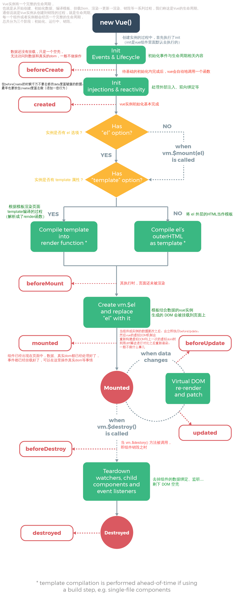

# Learn | 生命周期

3个特殊标记：
1. 创建实例 - 初始化事件监听、设置数据监听，并编译模板；
2. 挂载成功 - 将实例挂载到 DOM 结构，并在数据变化的时候更新 DOM；
3. 销毁 - 将之前的一切全部销毁；

> 钩子 - 钩子函数是 Windows 消息处理机制的一部分，通过设置“钩子”，应用程序可以在系统级对所有消息、事件进行过滤，访问在正常情况下无法访问的消息。

> 钩子的本质是一段用以处理系统消息的程序，通过系统调用，把它挂入系统。