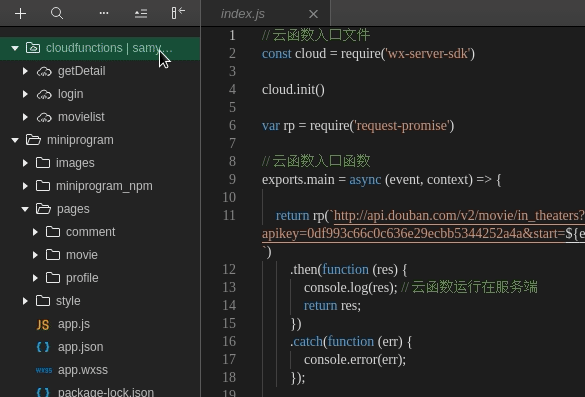
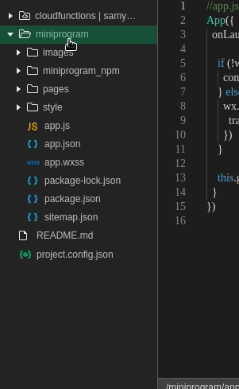
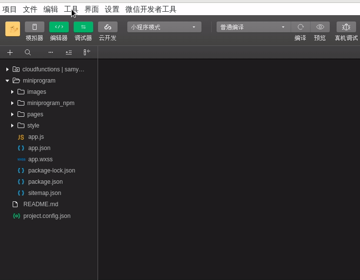
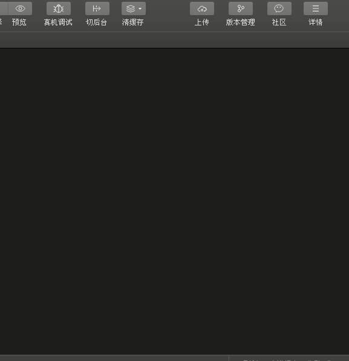
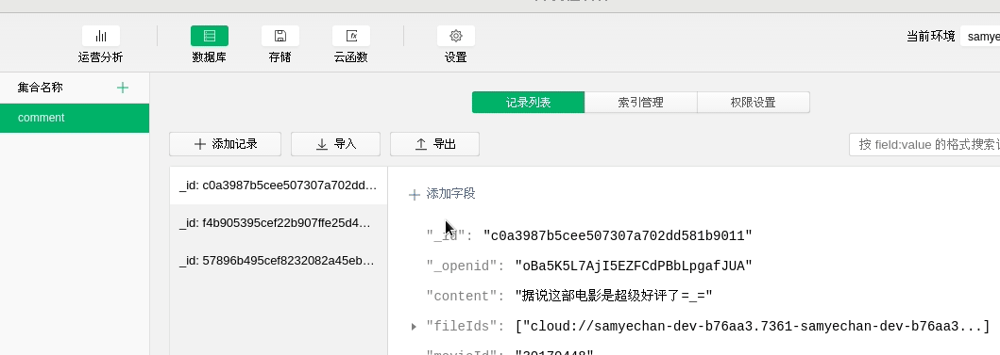
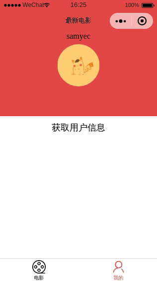
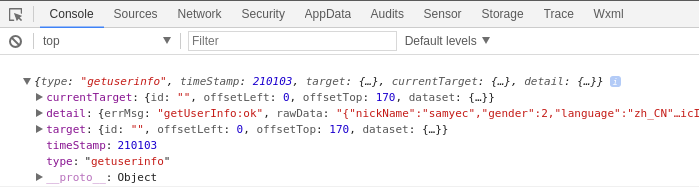

# Demo | 电影imooc_云开发

## 00 碎碎念

昂昂昂...从去年说要学小程序，到今天五月份了，还在入门的门外阶段，感觉自己真.拖.延.最近没有项目也没有了demo，余下了一片时间，嗯，it's time to say hello, weapp =_+

于是乎...我就去慕课学习了啊，还是不够爱学习，一如既往点击了“免费课程”：[《轻松入门微信小程序与云开发》](https://www.imooc.com/learn/1121)，其实老师讲得还是不错的，助我入了门？！

课程主要分成了三部分 = 小程序基础 + 云开发 + 电影demo，一贯的学习结构。其实这个课程一两天就能完全地走一遍的，然鹅...微信小程序开发工具没有Linux版本，但我就是倔(lan)，不想安虚拟机，和Centos搏斗了一二三天，终于看见了nice的界面啊～哈哈哈，虽然行为有点蠢，但蠢蠢地蛮有成就感呢～

附上大佬GitHub：[微信开发者工具Linux完美支持](https://github.com/cytle/wechat_web_devtools)，以及万分的感谢～

---

碎碎念了一堆没用的，还是得来点和demo相关的口水滴 +_=

小程序基础学习部分已(zhun)经(bei)写在上面的文中了，so...这一页就留给了我的第一个小程序demo上了啊。

**整个demo由三个页面组成 = 首页 + 详情页 + 用户页**，简单涉及了下面几个部分：

- wxml、wxss编写页面；
- 云函数编写 + api请求 + 数据获取；
- 下拉加载效果 + 加载提示；
- 模糊背景；
- 组件库的引入 + 使用；
- 图片上传 + 评价提交 + 数据库使用；
- 用户信息获取；

--- 

昂昂昂，那么 Let's GO！

<!-- = = = = = = = = = = = = = = = = = = = = = = = = = -->

## 01 电影主页

功能点：
1. [豆瓣api数据获取 + 数据展示](#API)；
2. [下拉加载数据](#UP_LOAD)；
3. [加载提示信息](#LOADING)；
4. [页面跳转](#JUMP_TO)；

实现效果：


### <a name="API">请求数据 | 云函数</a>

01. 首先，得给请求一片发挥的天地～～来，一起 **新建一个云函数**：



- 云函数文件夹下 `右键`，选择 `“新建Node.js云函数”`；
- 输入云函数名称（中文不可取名噢，所以gif报错了啊）；
- 谨记：一定要 `”创建并部署：xxxx“` 哟；

02. 接着呢，因为这个demo是通过云(fu)函(wu)数(duan)发送的请求，所以要用一用第三方库 [request-promise](https://github.com/request/request-promise)～

我们在上面新建的云函数文件夹右键选择 `在终端中打开`，进入终端界面，依次输入：

```bash
npm install --save request
npm install --save request-promise
```

03. 在新建云函数的 index.js文件中使用 `request-promise` 发送请求：

- 此处奉上 [豆瓣开放api文档](https://douban-api-docs.zce.me/)

```js
// 云函数入口文件
const cloud = require('wx-server-sdk')
// 初始化
cloud.init()
// 引入第三方库 request-promise (***)
var rp = require('request-promise')
// 云函数入口函数
exports.main = async (event, context) => {
  // 接入豆瓣api (***)
  return rp(`http://api.douban.com/v2/movie/in_theaters?apikey=0df993c66c0c636e29ecbb5344252a4a&start=${event.start}&count=${event.count}`)
    // 熟悉的promise写法 - then & catch 
    .then(function (res) {
        return res; // 返回数据
    })
    .catch(function (err) {
        console.error(err); // 记录错误
    });
}
```
04. 写完云函数逻辑，记得 **部署云函数** ！！

05. 最后就是在相关页面的js文件中引用上述的云函数啦～ `wx.cloud.callFunction`。

小程序初始化的js文件中预定义了很多类生命周期函数，电影列表的数据加载应放在页面加载之时，如下：

```js
/**
 * 页面的初始数据
 */
data: {
  movieList: [] // 电影列表
},
/**
 * 生命周期函数--监听页面加载
 */
onLoad: function (options) {
  wx.cloud.callFunction({
    name: 'movielist',
    data: {
      start: 0,
      count: 10
    }
  }).then(res => {
    this.setData({
      movieList: this.data.movieList
    })
  }).catch(err => {
    console.error(err);
  });
}
```

### <a name="UP_LOAD">下拉加载</a>

```js
// 获取数据列表（写在一个方法中，方便后续调用于不同的地方）
getMovieList: function () {
  wx.cloud.callFunction({
    name: 'movielist',
    data: {
      // 每次请求时的起点应该就是列表长度
      start: this.data.movieList.length,
      count: 10
    }
  }).then(res => {
    this.setData({
      // 每次获取数据后应该将它拼接在数据后面 - concat()连接两个或多个数组
      movieList: this.data.movieList.concat(JSON.parse(res.result).subjects) 
    })
  }).catch(err => {
    console.error(err);
  });
},

/**
 * 页面上拉触底事件的处理函数
 */
onReachBottom: function () {
  this.getMovieList();
}
```

### <a name="LOADING">加载信息提示信息</a>

`wx.showLoading` & `wx.hideLoading`

```js
// 添加加载信息
wx.showLoading({
  title: '加载中...',
});

// 移除加载信息
wx.hideLoading();
```
### <a name="JUMP_TO">跳转页面</a>

`wxml` 代码：
```html
<button
  class='movie-comment'
  bindtap='toComment'
  data-movieid="{{item.id}}">评价</button>
```
- `bindtap`：绑定事件；
- `data-xxx`：自定义传递参数；

逻辑代码：
```js
// 跳转至评价页面
toComment: function (event) {
  wx.navigateTo({
    url: `../comment/comment?movieid=${event.target.dataset.movieid}`
  })
}
```
- 自定义参数的取用：`${event.target.dataset.xxx}`
<!-- = = = = = = = = = = = = = = = = = = = = = = = = = -->

## 02 电影详情页

功能点：

1. [电影模糊背景效果](#MASK)；
2. [vant组件库的使用](#VANT)；
3. [评价框 + 星级评分](#VANT_USE)；
4. [图片上传](#UP_IMG)；
5. [评价提交](#COMMIT)；

实现效果：


### <a name="MASK">背景模糊</a>

背景模糊的效果其实就是，将电影海报的这个图片也当作整个电影基础信息框的背景图片，并且有一定的“高斯模糊”效果，如图：


这个效果完全由CSS实现，而它的页面结构如下：
```html
<!-- 模糊背景图片 -->
<view
  class='detail-container'
  style='background: url({{detail.images.large}}) no-repeat top/cover'>
</view>
<!-- 模糊北京图片遮罩层 -->
<view class='detail-mask'></view>
```
设置2个 `view` 标签，一个放背景图并添加模糊效果，一个做底层（因为背景层设置了透明度呐）：
```css
/* 模糊背景图片 */
.detail-container {
  height: 400rpx;
  /* 背景模糊 - filter滤镜属性：blur()高斯模糊 */
  /* blur值一般以px为单位，可以理解为“近视眼以这个距离看图片” */
  filter: blur(40rpx);
  /* 设置透明度，使图片可显 */
  opacity: .4;
}
/* 模糊背景图片遮罩层：定位遮罩层，zindex:-1遮罩层位于底层 */
.detail-mask {
  position: absolute;
  width: 100%;
  height: 400rpx;
  background-color: #333;
  top: 0;
  left: 0;
  z-index: -1;
}
```

### <a name="VANT">小程序引入第三方组件库</a>

1. 安装第三方组件库前的基础设置：

- 在终端打开 `miniprogram`文件夹：



- 在其下初始化一个文件 `package.json`（作用：基本信息配置及相关依赖包的管理），并做好相关设置：

```bash
npm init
```
- 按照官方命令安装对应的包：

```bash
npm i vant-weapp -S
```
- **构建npm**：



构建完成后 `miniprogram`文件夹下会多出来一个叫 `miniprogram_npm` 的包，里面就放置着上一步所安装的组件库啦～～

- 最后的关键一步！`详情` 中勾选 `使用npm模块`：



**只有勾选以后，第三方的组件库才能起作用哟**

### <a name="VANT_USE">评价 + 评分</a>

电影详情页中的评价与评分界面都是引用的 `vant` 组件，都需要在页面文件夹下的 `xxx.json` 文件中写引用：

```json
{
  "usingComponents": {
    "van-field": "/vant-weapp/field/",
    "van-rate": "/vant-weapp/rate/",
    "van-button": "/vant-weapp/button/"
  }
}
```

写评价和星级评分的功能完全借用的组件库中的 `Field 输入框` 和 `Rate 评分`，二者实现类似：

```html
<!-- 评价部分 -->
<van-field
  value="{{ comment }}"
  placeholder="写一些评价吧"
  bind:change="onConentChange"/>
<!-- 星级评分 -->
<van-rate value="{{ score}}" bind:change="onScoreChange" />
```
绑定相应变量，但这不像Vue，不是超方便的非双向绑定，所以要在内容变化时定义一个方法来时时赋值给定义的变量～

```js
/**
 * 页面的初始数据
 */
data: {
  ...
  content: '', // 评价内容
  score: 5, // 评价分数
  ...
},

// 评论
onConentChange: function (event) {
  this.setData({
    content: event.detail
    // 这个detail是vant组件中自定义的，或取到组件返回的相应用户输入
  });
},

// 评分
onScoreChange: function (event) {
  this.setData({
    score: event.detail
  });
}
```

### <a name="UP_IMG">图片上传 + 预览</a>

#### 图片上传

图片上传的功能其实就是给一个普通加特效=_=，绑定一个 `uploadImg` 方法让它变得迷人极了:

```html
<!-- 图片上传 -->
<van-button
    type="warning"
    bindtap='uploadImg'>上传图片</van-button>
```
让按钮变身的神奇托尼，是小程序自提供的API，小法子 `wx.chooseImage`：
```js
data: {
  ...
  images: [], // 上传的图片
  ...
},
// 图片上传
uploadImg:  function () {
  // 选择图片（api）
  wx.chooseImage({
    // 图片上传个数
    count: 9,
    // 图片是否进行压缩
    sizeType: ['original', 'compressed'],
    // 图片来源
    sourceType: ['album', 'camera'],
    // 图片上传成功后执行的回调函数
    success: res => {
      // tempFilePath可以作为img标签的src属性显示图片 - 一个临时路径
      const tempFilePaths = res.tempFilePaths
      // 赋值
      this.setData({
          images: this.data.images.concat(tempFilePaths)
          // 记得concat一下哈
      });
    }
  })
}
```
`wx.chooseImage` 提供了选择参数基本满足大部分需求，我们只需要按需设置，最后都是 -- “取东西赋值”。

#### 图片预览

昂，图片的预览其实就是一个数据的循环显示了，将图片显示出来以后，再用css魔法打扮一下，ok～

```html
<!-- 图片预览 -->
<view>
  <image
    class="comment-img"
    src="{{item}}"
    wx:for="{{images}}"
    wx:key="{{index}}"></image>
</view>
```

### <a name="COMMIT">评价提交</a>

评价提交就是将上面拿到的所有数据存到云数据库当中，那么首先，你就得有一个云数据库集合啦 +.+



接着敲！代！码！万能的 button 又上场：

```html
<!-- 评价提交 -->
<van-button
  type="danger"
  size='large'
  bindtap='submit'>提交评价</van-button>
```
蓝后，就是大片的逻辑代码了，涉及到了一个异步问题，所以需要请出 `Promise` 大佬：

```js
// 提交评价
submit: function () {
  // 加载提示
  wx.showLoading({
    title: '评价中...',
  })
  // 上传图片到云存储
  let promiseArr = [];
  for (let i = 0; i < this.data.images.length; i++) {
    promiseArr.push(new Promise((resolve, reject) => {
      let item = this.data.images[i];
      // 正则表达式，返回文件扩展名
      let suffix = /\.\w+$/.exec(item)[0];
      // 云函数提供API
      wx.cloud.uploadFile({
        // 上传至云端的路径
        cloudPath: new Date().getTime() + suffix,
        // 小程序临时文件路径
        filePath: item,
        // 成功
        success: res => {
          // 返回文件id
          this.setData({
              fileIds: this.data.fileIds.concat(res.fileID)
          });
          resolve();
        },
        // 失败
        fail: console.error
      })
    }))
  }

  // 当所有处理都成功执行后才执行（即所有图片均成功上传）
  Promise.all(promiseArr).then(res => {
    // 要将数据存在名为 comment 的数据库中
    db.collection('comment').add({
      // 需要存于云数据库的数据
      data: {
        content: this.data.content,
        score: this.data.score,
        movieId: this.data.movieId,
        fileIds: this.data.fileIds
      }
    }).then(res => {
      wx.hideLoading(); // 移除加载提示
      wx.showToast({    // 添加操作提示
        title: '评价成功！',
      })
    }).catch(err => {
      wx.hideLoading();
      wx.showToast({
        title: '评价失败...,'
      })
    })
  })
}
```

<!-- = = = = = = = = = = = = = = = = = = = = = = = = = -->

## 03 个人信息页

#### 方法01

使用小程序组件 `open-data`，其用于展示微信开放的数据，此处关注其中的 `type` 属性：

值 | 说明 
:-: | :-:
groupName | 拉取群名称
userNickName | 用户昵称
userAvatarUrl | 用户头像
userGender | 用户性别
userCity | 用户所在城市
userProvince | 用户所在省份
userCountry | 用户所在国家
userLanguage | 用户的语言

**简单使用** 

```html
<open-data type="userAvatarUrl"></open-data>
```

#### 方法02

利用小程序 `button` 组件中的 `open-type` 属性的 `getUserInfo`（获取用户信息，可以从bindgetuserinfo回调中获取到用户信息）：

```html
<button
  open-type='getUserInfo'
  bindgetuserinfo='onGotUserInfo'>
    点击获取用户信息
</button>
```
实现效果：



逻辑部分：（昂，虽然这里并无逻辑可言）

```js
// 获取当前用户信息
onGotUserInfo: function (event) {
  // 打印获取到的用户信息
  console.log(event);
}
```
看吧，拿到数据咯：




<!-- = = = = = = = = = = = = = = = = = = = = = = = = = -->

## 04 小结

虽然这个demo很简单，但是终于让我入了门，还发现了云开发这么(bu)方(yao)便(qian)的方法，哎哎哎，自己还是只蛙啊，世界有意思可以学习的东西这么多，得努力地跳出去呐～

> Do one thing and do it well.